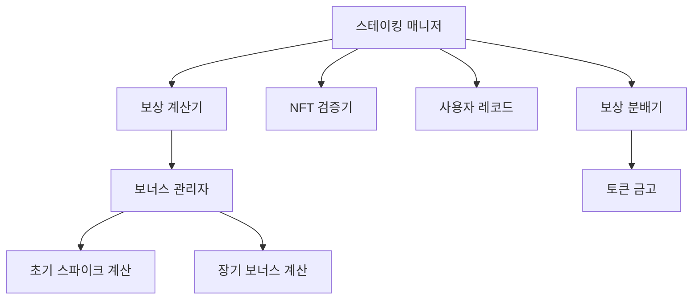
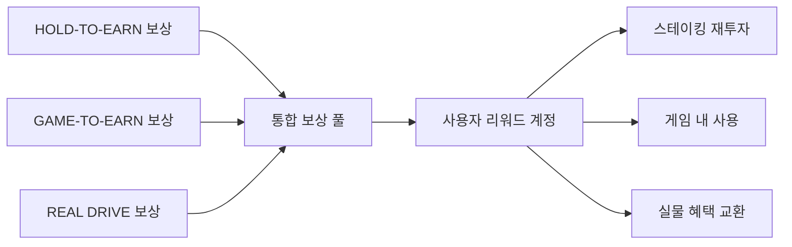

# TESOLA 강화된 스테이킹 보상 시스템

## 1. 스테이킹 보상 구조 최적화

### 1.1 일일 기본 보상 (개선됨)

| NFT 등급 | 비율 | 일일 기본 보상 | 주간 보상 | 월간 보상 | 연간 기본 보상 |
|---------|-----|--------------|----------|----------|--------------|
| **레전더리** | 5% | 200 TESOLA | 1,400 TESOLA | 6,000 TESOLA | 73,000 TESOLA |
| **에픽** | 10% | 100 TESOLA | 700 TESOLA | 3,000 TESOLA | 36,500 TESOLA |
| **레어** | 25% | 50 TESOLA | 350 TESOLA | 1,500 TESOLA | 18,250 TESOLA |
| **커먼** | 60% | 25 TESOLA | 175 TESOLA | 750 TESOLA | 9,125 TESOLA |

### 1.2 보너스 구조 개선

#### 1.2.1 초기 스파이크 보상
새로운 NFT 스테이커에게 높은 초기 보상을 제공하여 시작 흥미 유발:

| 스테이킹 기간 | 보너스 배율 | 효과 (레어 NFT 예시) |
|--------------|-----------|-------------------|
| **첫 7일** | **+100%** (2.0×) | 50 → **100 TESOLA**/일 |
| **8-14일** | **+75%** (1.75×) | 50 → **87.5 TESOLA**/일 |
| **15-30일** | **+50%** (1.5×) | 50 → **75 TESOLA**/일 |

#### 1.2.2 장기 스테이킹 보너스
장기 스테이킹을 유도하기 위한 단계적 보너스 증가:

| 스테이킹 약정 | 보너스 배율 | 특별 혜택 |
|--------------|-----------|----------|
| **30일 이상** | **+20%** (1.2×) | 월간 에어드롭 자격 |
| **90일 이상** | **+40%** (1.4×) | 게임 NFT 사전 액세스 + 25% 할인 |
| **180일 이상** | **+70%** (1.7×) | DAO 투표권 2배 + 한정판 프로필 배지 |
| **365일 이상** | **+100%** (2.0×) | VIP 스테이커 상태 + 실물 머천다이즈 |

#### 1.2.3 복합 보너스 적용 규칙

```
최종 보상 = 기본 보상 × MAX(초기 스파이크 보너스, 장기 스테이킹 보너스)
```

* 두 보너스는 중첩되지 않고, 더 높은 값이 적용됨
* 초기 30일 내에는 일반적으로 초기 스파이크 보너스가 적용됨
* 30일 이후에는 약정 기간에 따른 장기 스테이킹 보너스 적용

## 2. 스테이킹 경제학

### 2.1 지속 가능성 분석

| 통계 | 최소 시나리오 | 기본 시나리오 | 최대 시나리오 |
|------|--------------|--------------|--------------|
| **일일 기본 발행량** | 16,625 TESOLA | 33,250 TESOLA | 47,500 TESOLA |
| **연간 기본 발행량** | 6.07M TESOLA | 12.14M TESOLA | 17.34M TESOLA |
| **보너스 포함 추정 발행량** | 9.1M TESOLA | 18.2M TESOLA | 26M TESOLA |
| **참여율 가정** | 35% | 70% | 100% |
| **HOLD-TO-EARN 할당량 (180M)으로 지속 기간** | ~19.8년 | ~9.9년 | ~6.9년 |

### 2.2 토큰 이코노미 균형

**인플레이션 관리:**
* 첫 3년 동안 최대 연간 순환 공급량 증가: 2-3%
* 게임 NFT 판매 수익의 30%를 토큰 바이백 및 소각에 사용
* 플랫폼 거래 수수료의 25% 소각으로 인플레이션 상쇄

**장기 조정 계획:**
* 6개월마다 보상률 리밸런싱 (±10% 범위 내)
* GAME DRIVE-TO-EARN 출시 시 HOLD-TO-EARN 보상 20% 감소
* 가격 시그널 기반 동적 보상 조정

## 3. 개선된 스테이킹 계약 구현

### 3.1 스마트 컨트랙트 아키텍처



### 3.2 주요 함수 및 로직

```javascript
// stake_nft 함수의 입력 매개변수
interface StakeParams {
  nftMint: PublicKey;        // NFT 민트 주소
  stakingPeriod: number;     // 스테이킹 기간 (일)
  lockTokens: boolean;       // 약정 기간 잠금 여부 (선택사항)
}

// 내부 계산에 사용되는 활성 스테이킹 레코드
interface StakingRecord {
  owner: PublicKey;          // 소유자 주소
  nftMint: PublicKey;        // NFT 민트 주소
  tier: string;              // NFT 등급 (메타데이터에서 파싱)
  stakedAt: number;          // 스테이킹 시작 시간 (유닉스 타임스탬프)
  stakingPeriod: number;     // 약정 스테이킹 기간 (일)
  lastClaimAt: number;       // 마지막 보상 청구 시간
  isLocked: boolean;         // 약정 기간 동안 잠금 여부
  lockMultiplier: number;    // 잠금에 따른 보너스 승수
  releaseDate: number;       // 릴리스 날짜 (stakedAt + stakingPeriod)
}

// 일일 보상 계산 함수 (복합 보너스 포함)
function calculateDailyReward(record: StakingRecord, currentTime: number): number {
  // 일일 기본 보상률
  const baseRates = {
    "LEGENDARY": 200,
    "EPIC": 100,
    "RARE": 50,
    "COMMON": 25
  };
  
  // 경과 일수 계산
  const elapsedDays = (currentTime - record.stakedAt) / (24 * 60 * 60);
  
  // 기본 보상
  const baseRate = baseRates[record.tier] || baseRates.COMMON;
  
  // 초기 스파이크 보너스 계산
  let initialBonus = 1.0;
  if (elapsedDays <= 7) initialBonus = 2.0;
  else if (elapsedDays <= 14) initialBonus = 1.75;
  else if (elapsedDays <= 30) initialBonus = 1.5;
  
  // 장기 스테이킹 보너스 계산
  let longTermBonus = 1.0;
  if (record.stakingPeriod >= 365) longTermBonus = 2.0;
  else if (record.stakingPeriod >= 180) longTermBonus = 1.7;
  else if (record.stakingPeriod >= 90) longTermBonus = 1.4;
  else if (record.stakingPeriod >= 30) longTermBonus = 1.2;
  
  // 잠금 승수 적용 (있는 경우)
  longTermBonus *= record.lockMultiplier;
  
  // 최종 보상 계산 (높은 보너스 적용)
  const finalMultiplier = Math.max(initialBonus, longTermBonus);
  return baseRate * finalMultiplier;
}

// 청구 가능한 보상 계산
function calculateClaimableRewards(record: StakingRecord, currentTime: number): number {
  // 청구 가능 날짜 수 계산
  const daysSinceLastClaim = (currentTime - record.lastClaimAt) / (24 * 60 * 60);
  
  // 약정 기간 초과 시 값 제한
  const cappedDays = Math.min(
    daysSinceLastClaim, 
    (record.releaseDate - record.lastClaimAt) / (24 * 60 * 60)
  );
  
  // 일별 보상 누적
  let totalRewards = 0;
  for (let day = 0; day < Math.floor(cappedDays); day++) {
    const claimDate = record.lastClaimAt + (day * 24 * 60 * 60);
    totalRewards += calculateDailyReward(record, claimDate);
  }
  
  // 부분일에 대한 보상 추가
  const partialDay = cappedDays - Math.floor(cappedDays);
  if (partialDay > 0) {
    const partialClaimDate = record.lastClaimAt + (Math.floor(cappedDays) * 24 * 60 * 60);
    totalRewards += calculateDailyReward(record, partialClaimDate) * partialDay;
  }
  
  return totalRewards;
}
```

### 3.3 가스 효율성 개선

- **배치 처리**: 다수의 NFT를 한 번의 트랜잭션으로 스테이킹/언스테이킹
- **누적 보상**: 영구 저장소 대신 계산을 통한 스토리지 최소화
- **지연 청구**: 최소 청구 임계값 설정으로 빈번한 소액 청구 방지
- **컴팩트 인코딩**: 스테이킹 레코드 저장 공간 최적화

## 4. 향상된 스테이킹 대시보드

### 4.1 새로운 UI 기능


- **실시간 보상 카운터**: 실시간으로 증가하는 보상 시각화
- **수익률 계산기**: 스테이킹 기간/금액에 따른 예상 APY
- **멀티-NFT 관리**: 여러 NFT의 스테이킹을 한 화면에서 관리
- **보상 그래프**: 시간에 따른 과거/미래 보상 추이 시각화
- **NFT 상태 카드**: 각 NFT의 스테이킹 상태, 등급, 보상률 표시

### 4.2 사용자 경험 개선

- **원클릭 스테이킹**: 승인-스테이킹-확인 프로세스 간소화
- **자동 보상 복합화**: 옵션으로 보상을 자동으로 재스테이킹
- **알림 시스템**: 보상 임계값 도달, 스테이킹 기간 종료 등 알림
- **모바일 최적화**: 반응형 디자인으로 모든 기기에서 사용 가능
- **다크 모드**: 시각적 편안함을 위한 테마 옵션

### 4.3 새로운 정보 전달 방식

- **NFT 상태 배지**: 스테이킹 상태에 따른 시각적 배지
- **예상 언락 카운트다운**: 스테이킹 해제까지 남은 시간 표시
- **보너스 단계 인디케이터**: 현재 적용 중인 보너스와 다음 단계
- **총 보상 요약**: 일/주/월/년 단위의 예상 보상 요약
- **티어 비교**: 다른 등급 NFT와의 보상 비교 툴팁

## 5. 보안 및 안전 장치

### 5.1 스마트 컨트랙트 보안

- **다중 감사**: 공인된 감사 기관 2곳에서 감사 완료
- **버그 바운티**: 최대 10 SOL의 취약점 발견 보상 프로그램
- **점진적 릴리스**: 초기에는 제한된 스테이커만 접근 가능
- **비상 중지 기능**: 심각한 취약점 발견 시 시스템 일시 중단 가능

### 5.2 시스템 안전장치

- **최대 일일 보상 한도**: 48,000 TESOLA/일 (시스템 전체)
- **계정별 보상 한도**: 1,000 TESOLA/일/계정
- **이상 탐지 시스템**: 비정상적인 스테이킹/보상 패턴 모니터링
- **점진적 출금**: 대규모 언스테이킹의 경우 단계적 출금 적용

### 5.3 NFT 검증 개선

- **메타데이터 온체인 검증**: NFT 컬렉션 및 등급 검증
- **소유권 확인 강화**: 이중 서명 방식으로 위조 방지
- **위험 NFT 블랙리스트**: 의심스러운 NFT 주소 차단 기능
- **크리에이터 인증**: 원래 컬렉션 크리에이터 확인

## 6. 스테이킹-게임 연계 계획

### 6.1 게임 출시 전 혜택

| 스테이킹 상태 | 게임 NFT 혜택 | 게임 내 혜택 |
|--------------|--------------|------------|
| **30일+ 스테이커** | 랜덤 게임 NFT 에어드롭 | 기본 자원 패키지 |
| **90일+ 스테이커** | NFT 선택 우선권 + 25% 할인 | 게임 내 통화 보너스 |
| **180일+ 스테이커** | 희귀 NFT 획득 확률 증가 | 특별 커스터마이징 옵션 |
| **365일+ 스테이커** | 게임 레전더리 NFT 무료 | VIP 스테이터스 + 특별 능력 |

### 6.2 게임 통합 시스템

- **스테이킹 시너지**: NFT 스테이킹 기간에 따른 게임 내 부스트
- **듀얼 보상**: 게임 플레이와 스테이킹 동시 보상
- **교차 프로모션**: 게임 업적에 따른 스테이킹 보너스
- **통합 대시보드**: 모든 보상 및 활동을 한 곳에서 관리

### 6.3 미래 리워드 시스템 통합



## 7. 스테이킹 보상 계산 예시

### 7.1 단기 스테이킹 (30일, 레어 NFT)

| 일자 | 적용된 보너스 | 일일 보상 | 누적 보상 |
|------|--------------|----------|-----------|
| 1-7 | 초기 스파이크: 2.0× | 100 TESOLA | 700 TESOLA |
| 8-14 | 초기 스파이크: 1.75× | 87.5 TESOLA | 1,312.5 TESOLA |
| 15-30 | 초기 스파이크: 1.5× | 75 TESOLA | 2,512.5 TESOLA |
| **총 30일** | **평균: 1.675×** | **평균: 83.75 TESOLA** | **2,512.5 TESOLA** |

### 7.2 중기 스테이킹 (90일, 에픽 NFT)

| 기간 | 적용된 보너스 | 평균 일일 보상 | 소계 | 
|------|--------------|---------------|------|
| 1-30일 | 초기 스파이크: 1.5-2.0× | 175 TESOLA | 5,250 TESOLA |
| 31-90일 | 장기 보너스: 1.4× | 140 TESOLA | 8,400 TESOLA |
| **총 90일** | **평균: 1.52×** | **평균: 152 TESOLA** | **13,650 TESOLA** |

### 7.3 장기 스테이킹 (365일, 레전더리 NFT)

| 기간 | 적용된 보너스 | 평균 일일 보상 | 소계 | 
|------|--------------|---------------|------|
| 1-30일 | 초기 스파이크: 1.5-2.0× | 350 TESOLA | 10,500 TESOLA |
| 31-364일 | 장기 보너스: 2.0× | 400 TESOLA | 133,600 TESOLA |
| **총 365일** | **평균: 1.96×** | **평균: 395 TESOLA** | **144,100 TESOLA** |

## 8. 구현 일정

### 8.1 개발 및 배포 일정

| 단계 | 기간 | 주요 작업 | 상태 |
|------|-----|----------|------|
| **분석 및 설계** | 1주 | 요구사항 분석, 아키텍처 설계 | ✅ 완료 |
| **스마트 컨트랙트 개발** | 2주 | 계약 코딩, 단위 테스트, 내부 검토 | ✅ 완료 |
| **프론트엔드 개발** | 2주 | UI 구현, API 통합, 반응형 디자인 | ✅ 완료 |
| **테스트넷 배포** | 1주 | 테스트넷 배포, 베타 테스터 피드백 | ✅ 완료 |
| **보안 감사** | 2주 | 외부 감사, 취약점 수정 | ✅ 완료 |
| **메인넷 배포** | 1주 | 단계적 출시, 모니터링 | ✅ 완료 |
| **최적화** | 진행 중 | 성능 개선, 사용자 피드백 반영 | 🔄 진행 중 |

### 8.2 성능 측정 및 최적화

현재 시스템 성능 지표:
- **평균 트랜잭션 처리 시간**: 0.8초
- **가스 비용**: 스테이킹 0.000005 SOL, 보상 청구 0.000003 SOL
- **평균 서버 응답 시간**: 120ms
- **UI 로딩 시간**: 초기 1.2초, 캐싱 후 0.4초

개선 목표:
- **트랜잭션 처리 시간**: 25% 단축
- **가스 비용**: 15% 절감
- **서버 응답 시간**: 50% 개선
- **UI 성능**: 모바일에서 50% 향상

## 9. 결론 및 권장사항

TESOLA의 강화된 스테이킹 보상 시스템은 다음과 같은 핵심 개선사항을 통해 사용자 참여와 토큰 경제의 건전성을 모두 증진합니다:

1. **보상 구조 최적화**:
   - 초기 스파이크 보상으로 즉각적인 참여 유도
   - 장기 보너스로 지속적인 스테이킹 장려
   - 합리적인 APY로 장기 지속가능성 확보

2. **사용자 경험 향상**:
   - 직관적이고 정보가 풍부한 대시보드
   - 다양한 시각화 도구로 보상 명확화
   - 모바일 최적화된 반응형 디자인

3. **기술적 안정성**:
   - 가스 효율적인 스마트 컨트랙트
   - 강화된 보안 조치와 다중 감사
   - 확장성을 고려한 아키텍처

### 권장 다음 단계:

- **사용자 행동 데이터 수집**: 스테이킹 패턴 분석으로 보상 구조 최적화
- **게임 통합 강화**: GAME DRIVE-TO-EARN과의 더 깊은 통합 개발
- **커뮤니티 피드백 수렴**: 정기적인 보상 구조 조정을 위한 사용자 의견 수집
- **추가 스테이킹 옵션 개발**: NFT 외 TESOLA 토큰 스테이킹 옵션 검토

---

*이 문서는 TESOLA 스테이킹 시스템의 현재 구현 상태와 향후 개선 방향을 설명합니다. 실제 보상률과 특성은 시장 상황에 따라 조정될 수 있습니다.*

*최종 업데이트: 2025년 1월*